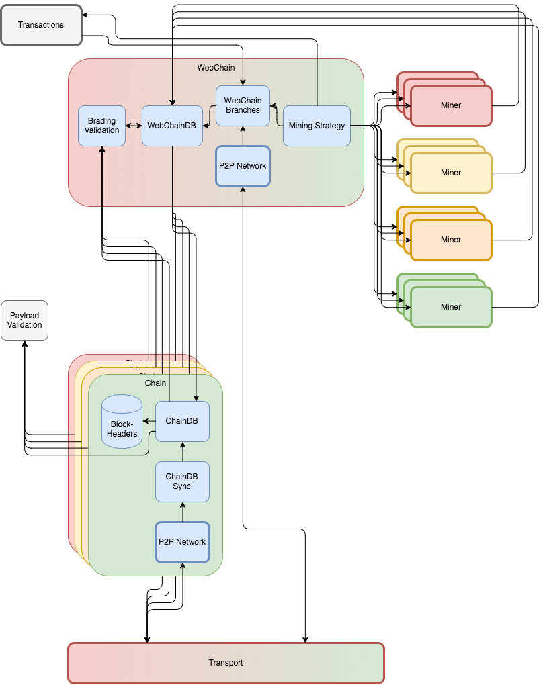

# Chainweb

A Proof-of-Work Parallel-Chain Architecture for Massive Throughput.
Read [our whitepaper](http://kadena.io/docs/chainweb-v15.pdf).

## Building from Source

### Building with Nix

The most reliable way to build chainweb is to use the
[Nix](https://nixos.org/nix/) package manager. Once you've installed Nix, use
the command `nix-build` from the repository root to build chainweb. To do
incremental builds, run `nix-shell` and then `cabal build` or `cabal new-build`
inside the resulting shell.

### Other Build Methods

Requirements:

- Cabal >= 2.2
- GHC >= 8.4
- (optional) Stack >= 1.9

To build the various Chainweb components, run one of the following:

```
# To build with cabal
cabal install --enable-tests

# To build with stack
stack install --test
```

This will build the chainweb library, the `chainweb-node` executable, the main
test suite, and a few extra example executables.

## Running a chainweb-node

On startup a chainweb-node tries to connect to the P2P network. For that each
chainweb-node knows about a hard-coded set of bootstrap nodes. For the *Test*
chainweb-node, this is a single node with with peer-id
`525ff65f-9240-4ada-9c36-fe7da982b4b4`, host-name `localhost`, and port `1789`.

In order for a chainweb-node to be useful it must be able to connect to the
bootstrap node. The *Test* bootstrap node can be started as follows:

```sh
chainweb-node --node-id=0 --peer-id=525ff65f-9240-4ada-9c36-fe7da982b4b4 --host=localhost --port=1798
```

(`--host=127.0.0.1` can be used to restrict availability of the node to the
loopback network.)

When the default bootstrap node is available additional chainweb-nodes can be
started as

```sh
chainweb-node --node-id=NID --port=0
```

where `NID` must be replaced with a unique node id.

Specifying a port number of `0` causes the node to request a free port from the
operating system.

If the `--peer-id` parameter is omitted a new peer-id is created on startup.

## Configuring a chainweb-node

Alternative or additional bootstrap nodes can be specified at startup either on
the command line or through a configuration file.

The available command line options are shown by running

```sh
chainweb-node --help
```

The configuration of a chainweb-node can be printed by appending
`--print-config` to the command line. Without any additional command line
arguments `chainweb-node --print-config` shows the default configuration.

Custom configurations can be created by generating a configuration file
with the default configuration:

```sh
chainweb-node --print-config > chainweb-node.config
```

After editing the configuration file `chainweb-node.config` the custom
configuration can be loaded with

```sh
chainweb-node --config-file=chainweb-node.config
```

## Running the Examples

A simple end-to-end example for mining and synchronizing nodes for a single
chain is provided in `single-chain-example`. It demonstrates simple usage of the
`P2P`, `Sync` and `BlockHeaderDB` modules of the `chainweb` library.

```bash
cabal run single-chain-example

stack exec single-chain-example
```

## Component Structure

The production components are:

*   `chainweb` library: It provides the implementation for the different
    components of a chainweb-node.

*   `chainweb-node`: An application that runs a Chainweb node. It maintains copies
    of a number of chains from a given Chainweb instance. It provides interfaces
    (command-line and RPC) for directly interacting with the chainweb or for
    implementing applications such as miners and transaction management tools.

*   `chainweb-tests`: A test suite for the chainweb library and chainweb-node.

In addition, the following example executables are included which demonstrate
the use of individual sub-components:

*   `single-chain-example`: An simple end-to-end scenario for mining
    and synchronizing nodes for a single chain.

*   `blockheaderdb-example`: Example for how to use the BlockHeaderDB API of chainweb.

*   `p2p-example`: A simple p2p network implementation.

# Architecture Overview

For a detailed description of the `chainweb` architecture,
[see here](docs/Architecture.md).


